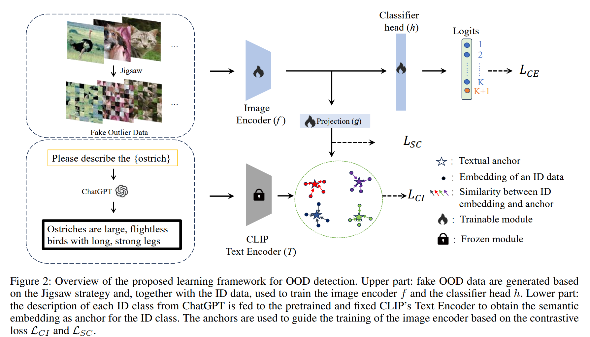

# TagFog
Code for AAAI2024 paper: TagFog：Textual Anchor Guidance and Fake Outlier Generation for Visual Out-of-distribution Detection
# Abstract
Out-of-distribution (OOD) detection is crucial in many realworld applications. However, intelligent models are often
trained solely on in-distribution (ID) data, leading to overconfidence when misclassifying OOD data as ID classes. In
this study, we propose a new learning framework which leverage simple Jigsaw-based fake OOD data and rich semantic
embeddings (‘anchors’) from the ChatGPT description of ID knowledge to help guide the training of the image encoder.
The learning framework can be flexibly combined with existing post-hoc approaches to OOD detection, and extensive em-
pirical evaluations on multiple OOD detection benchmarks demonstrate that rich textual representation of ID knowledge
and fake OOD knowledge can well help train a visual encoder for OOD detection. With the learning framework, new state-of-the-art performance was achieved on all the benchmarks.
# Method

# Data Preparation
## CIFAR
### In-distribution dataset
The downloading process will start immediately upon running.  
### Out-of-distribution dataset
We provide links and instructions to download each dataset:  
&bull; [SVHN](http://ufldl.stanford.edu/housenumbers/):download it and place it in the folder of `Datasets/SVHN`.  
&bull; [Textures](https://www.robots.ox.ac.uk/~vgg/data/dtd/download/dtd-r1.0.1.tar.gz):download it and place it in the folder of `Datasets/dtd`.  
&bull; [Places365](http://data.csail.mit.edu/places/places365/test_256.tar):download it and place it in the folder of `Datasets/places365/test_subset`.  
&bull; [LSUN-C](https://www.dropbox.com/s/fhtsw1m3qxlwj6h/LSUN.tar.gz):download it and place it in the folder of `Datasets/LSUN_C`.  
&bull; [LSUN-R](https://www.dropbox.com/s/moqh2wh8696c3yl/LSUN_resize.tar.gz):download it and place it in the folder of `Datasets/LSUN_R`.  
&bull; [iSUN](https://www.dropbox.com/s/ssz7qxfqae0cca5/iSUN.tar.gz):download it and place it in the folder of `Datasets/iSUN`.  
The directory structure looks like:

```python
datasets/
---cifar10/
---cifar100/
---dtd/
---iSUN/
---LSUN_C/
---LSUN_R/
---places365/test_subset
---SVHN/
```
## Large-scale Data
### In-distribution dataset
The ImageNet-1k dataset(ILSVRC-2012) can be downloaded [here](https://image-net.org/challenges/LSVRC/2012/index.php#) and place it in the folder of `datasets/ImageNet`.

Two ImageNet100 can be generated given the classnames and IDs provided in `data/ImageNet100/ImageNet100-I_class_list.txt` and `data/ImageNet100/ImageNet100-II_class_list.txt`

To create ImageNet100-I, the follow scripts can be used:
`python data/create_imagenet_subset.py --in_dataset ImageNet100-I --src-dir datasets/ImageNet --dst-dir datasets/ImageNet100-I`

### Out-of-Distribution dataset
We have curated 4 OOD datasets from [iNaturalist](https://arxiv.org/pdf/1707.06642.pdf), [SUN](https://vision.princeton.edu/projects/2010/SUN/paper.pdf), [Places](http://places2.csail.mit.edu/PAMI_places.pdf), and [Textures](https://arxiv.org/pdf/1311.3618.pdf), and de-duplicated concepts overlapped with ImageNet-100.
For iNaturalist,SUN,and Places,we have sampled 10,000 images from the selected concepts for each dataset, which can be download via following links:
```bash
wget http://pages.cs.wisc.edu/~huangrui/imagenet_ood_dataset/iNaturalist.tar.gz
wget http://pages.cs.wisc.edu/~huangrui/imagenet_ood_dataset/SUN.tar.gz
wget http://pages.cs.wisc.edu/~huangrui/imagenet_ood_dataset/Places.tar.gz
```
For Textures, we use the entire dataset, which can be downloaded from their [original_websit](https://www.robots.ox.ac.uk/~vgg/data/dtd/).
Please pull all download OOD datasets into `datasets/ImageNet_OOD_dataset`.
The directory structure looks like:

```python
datasets/
---ImageNet-I/
---ImageNet-II/
---ImageNet_OOD_dataset
------dtd/
------iNaturalist/
------Places/
------SUN/
```
## Train
To create Jigsaw data, please run `Jigsaw/create_jigsaw.sh`.  
The quantity of jigsaw data can be changed according to the requirements.    
The download links for pre-generated CIFAR-10 and CIFAR-100 jigsaw dataset samples corresponding to the training set data are available at [cifar10_jigsaw](https://drive.google.com/file/d/11t5Lcfz_YqWRuApduXZp6gVj5AUggPrP/view?usp=drive_link) and [cifar100_jigsaw](https://drive.google.com/file/d/1IFh6kzygt0Z27KFhWFsFA-yv81E1HBdC/view?usp=drive_link):please put the above two datasets in directories `datasets/cifar10_jigsaw` and `datasets/cifar100_jigsaw`. 
Since the ImageNet-100 dataset is too large, it can be generated by yourself, or download them by link [ImageNet100-I_jigsaw](https://drive.google.com/file/d/13RomnXpM0viiW4kKe39Ds7MrSp1mex9i/view?usp=drive_link) and [ImageNet100-II_jigsaw](https://drive.google.com/file/d/1_OudXMlYCq6SNfg0Nt0b076fHsi7gaoH/view?usp=drive_link) and please put the created datasets in directories `datasets/ImageNet100-I_jigsaw` or `datasets/ImageNet100-II_jigsaw`.   
For version of CIFAR,ImageNet-100 training, training can be done via `sh scripts/cifar10.sh` or `sh scripts/cifar100.sh` or `sh scripts/imagenet100_i.sh` or `sh scripts/imagenet100_ii.sh`.
## Evaluation
After the model has finished training, place the model files in the `saved_model` directory.
For version of CIFAR,ImageNet-100, evaluation for OOD detection can be down via `sh Detection/scripts/eval_cifar.sh` or `sh Detection/scripts/eval_imagenet.sh`
#### Our checkpoints can be downloaded here for  
[cifar10_resnet18](https://drive.google.com/file/d/1pVFgleXPfq7CQEYrLz23NEjnxarLw6qq/view?usp=share_link);  
[cifar10_resnet34](https://drive.google.com/file/d/1IhIEdxfIPIFmjME8fojiJMSPqd_gh5Qk/view?usp=share_link);  
[cifar10_wrn](https://drive.google.com/file/d/1CJ9NMjkPArO6wlpm4nBzjgnMqaRQra50/view?usp=drive_link);  
[cifar100_resnet18](https://drive.google.com/file/d/1i3ULcePKzx6QBtQ5h0Vp80D1M03JbFcf/view?usp=share_link);   
[cifar100_resnet34](https://drive.google.com/file/d/1ws2FZNZUuPVdlDeAPvOHmeeA7gdOtv5_/view?usp=share_link);  
[cifar100_wrn](https://drive.google.com/file/d/1qIIyDosowi_Bu12PDn9uIO_9QTjLWbQB/view?usp=drive_link);  
[ImageNet100-I_resnet50](https://drive.google.com/file/d/1GdognlPI8ojkh1GeFhoFBVx84mzLof6K/view?usp=drive_link);    
[ImageNet100-I_resnet101](https://drive.google.com/file/d/1mT5jmi8tvCA7KoPCkLCGsrksKrAdTA3E/view?usp=drive_link);  
[ImageNet100-II_resnet50](https://drive.google.com/file/d/1bzdqpMBC9zJWukLiP5DJ3GtD6Caui9zm/view?usp=drive_link);  
[ImageNet100-II_resnet101](https://drive.google.com/file/d/1QFdPSJEETyyCdVjRIyMWcJim5RSr_NXk/view?usp=drive_link);  
The performance of these checkpoints is consistent with the results.  
<!-- Our checkpoints for ablation study can be download here:
[AblationStudy_on_Cifar100](https://drive.google.com/drive/folders/1VHgbAw8M2XBLMHUDJtYkCSJUXcndFAg2?usp=drive_link)  
Our checkpoints for ablation study about nosupcon line can be download here:
[AblationStudy_nosupcon_path](https://drive.google.com/drive/folders/1NAGAnkPTQTYY2ADU4zSqSgxyB7-b9BEa?usp=drive_link) -->